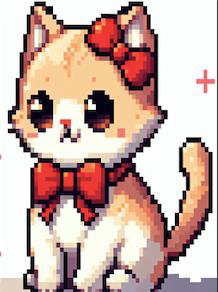

# Jogo dos Pares

Este é um projeto de um jogo de memória desenvolvido para crianças neuroatipicas com idades entre 4 e 6 anos. O jogo foi desenvolvido com o objetivo de oferecer uma experiência divertida e inclusiva, levando em consideração as necessidades sensoriais dessas crianças.
## Funcionalidades:

    Interface amigável e intuitiva, projetada para ser fácil de entender e navegar.
    Sons suaves e não perturbadores, especialmente ajustados para não sobrecarregar as crianças.
    Cores suaves e tons pastéis para uma experiência visual relaxante e confortável.
## Como Jogar:

O jogo de memória consiste em um tabuleiro de cartas viradas para baixo, cada uma representando um animal diferente. Ao clicar em uma carta, a carta emite o som característico do animal representado, como o som de um gato miando ou de um cachorro latindo. A criança deve clicar em duas cartas por vez, tentando encontrar os pares correspondentes. Se as cartas combinarem, elas permanecem viradas para cima e, em seguida, desaparecem. Caso contrário, elas são viradas novamente para baixo, e o jogador deve tentar novamente.
Descrição
### Vídeo da apresentação do jogo:
<iframe width="560" height="315" src="https://www.youtube.com/embed/wJziJbNlvb4" frameborder="0" allowfullscreen></iframe>
[Link para o vídeo de apresentação](https://youtu.be/wJziJbNlvb4)
### Vídeo da apresentação do jogo:
## Tecnologias Utilizadas:

     Construct 3: A ferramenta de desenvolvimento utilizada para criar o jogo.
    Design Sensível às Necessidades Sensoriais: Cores e sons cuidadosamente escolhidos para garantir uma experiência agradável e tranquila para crianças neuroatípicas.
    Inteligência Artificial para Geração de Imagens: Utilizada para garantir uniformidade na família de cartas do jogo.
## Este jogo foi desenvolvido por
 [Gabriel Gianini](https://github.com/gabriel-gianini/gabriel-gianini)
Com a parceria de
[LinkedIn](https://www.linkedin.com/in/lilian-barros-bertolaccini/) - Lilian Barros Bertolaccini [GitHub](https://github.com/LiliBertolaccini) - Lilian Barros Bertolaccini
### Contribuição:

Contribuições são bem-vindas! Se você deseja contribuir para o desenvolvimento deste projeto, sinta-se à vontade para abrir uma issue ou enviar um pull request.
